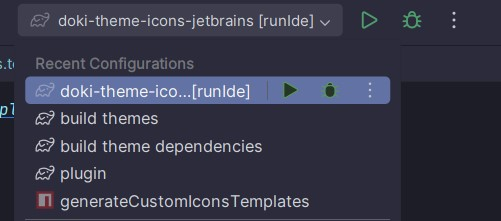

# Contributing

## Requirements

- Java 21+
- [Intellij Idea](https://www.jetbrains.com/idea/download)
- [Yarn 4+](https://yarnpkg.com/getting-started/install)
- IDE Plugins:
  - [Plugin Devkit](https://plugins.jetbrains.com/plugin/22851-plugin-devkit)
  - [Kotlin](https://plugins.jetbrains.com/plugin/6954-kotlin)

___

## Setup

Here are the steps for setting up your dev environment.

**NOTE:** There are preset run configurations available! See following image:

### Repo Dependencies

`doki-theme-icons-jetbrains` depends on **4** other repositories *(a.k.a. subprojects)*:

- [masterThemes](https://github.com/ZimCodes/doki-master-theme.git)
- [iconSource](https://github.com/ZimCodes/doki-icon-source.git)
- [doki-build-source-jvm](https://github.com/ZimCodes/doki-build-source-jvm)
- [doki-build-source](https://github.com/ZimCodes/doki-build-source.git)

Use the run configuration, `build theme deps`, to retrieve these repositories and build their important dependencies.

### Build Themes

It’s time to build the icons and theme definitions! This is handled by another run configuration,
`build themes [<variant-name>]`.

### Extra: Update Repo

Use the run configuration, `update repos`, to pull the latest changes from GitHub for the repo dependencies.

___

## Test Plugin

There are 2 ways to test out the plugin.

### `runIde` Task

Use run configuration, `test plugin [<variant-name>]`.

### Build and Use Method

This method involves building the plugin and installing it on your *own* IDE.

1. Use run configuration, `create plugin [<variant-name>]`
2. Navigate to `Settings > Plugins ⚙️ > Install plugin from disk.`
3. Select `doki-icons-<version>.zip` found in the `build/distributions` folder to install plugin.

---

## Create Custom Icon Colors

Want to create a custom color scheme for a doki icon? See [New Custom Colors](./md_docs/NEW_CUSTOM_COLORS.md)